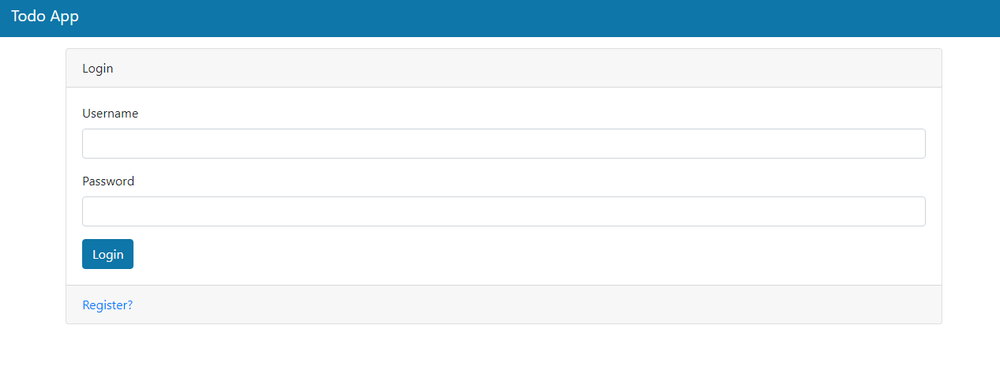
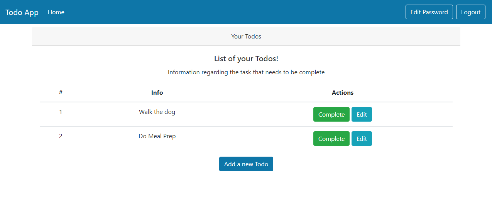

# [TodoApp]

A simple TodoApp that is lightweight and minimal.





## How it works

Clone the repository on your machine.

Run the following commands in the terminal:

```bash
/venv/Scripts/activate.bat
uvicorn main:app --reload
```

The app will be available at `http://localhost:8000`